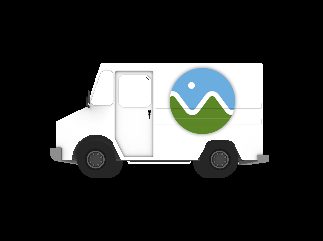
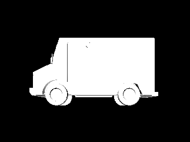
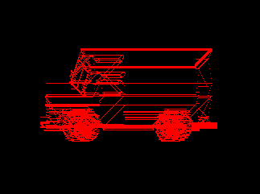
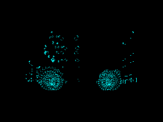
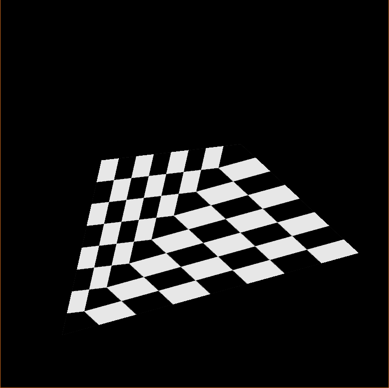
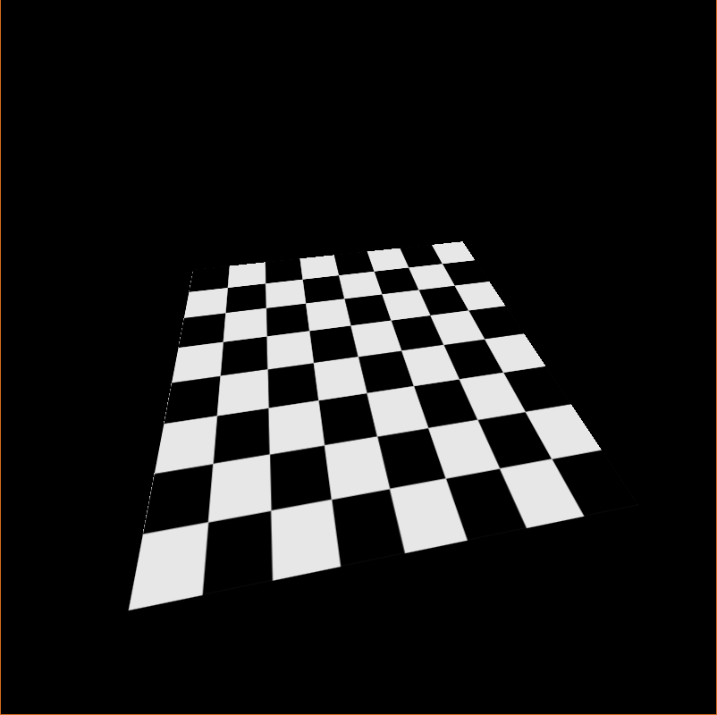
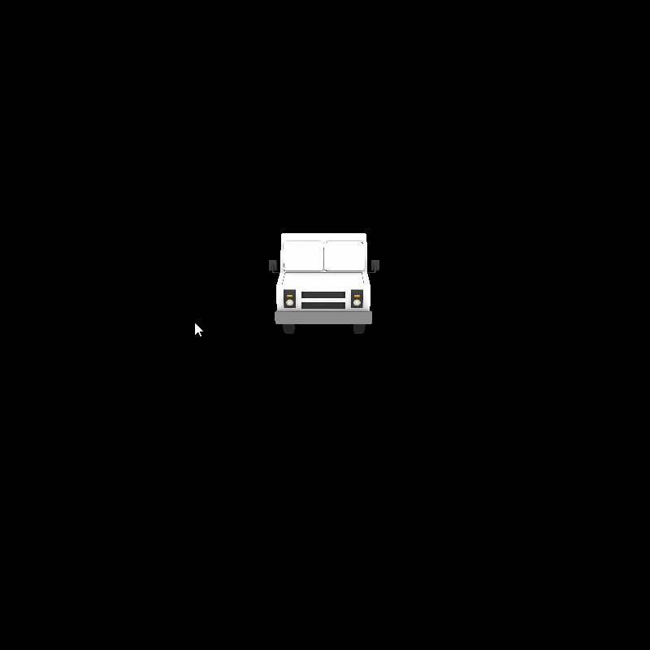
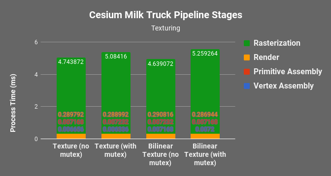
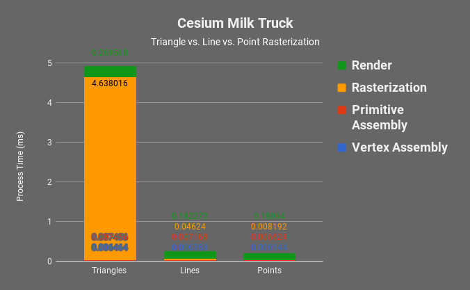
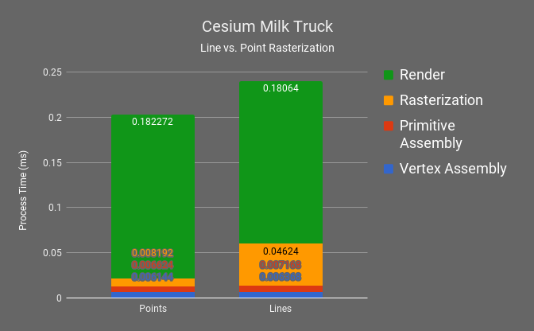

CUDA Rasterizer
===============

**University of Pennsylvania, CIS 565: GPU Programming and Architecture, Project 4**

* Jonathan Lee
* Tested on: Tested on: Windows 7, i7-7700 @ 4.2GHz 16GB, GTX 1070 (Personal Machine)

# Overview

In this project, I was able to implement a basic graphics pipeline in CUDA including the *Vertex Shading*, *Primitive Assembly*, *Rasterization*, and *Fragment Shading* stages.

## Features
* UV Texture Mapping with Bilinear Filtering and Perspective Correct Coordinates
* Line and Point Rasterization
* Naive Backface Culling 

## Flags
* `DRAWLINES`
* `DRAWPOINTS`
* `TEXTURE`
* `BILINEAR`
* `PERPSECTIVE_CORRECT`
* `MUTEX`

# Results

## Rasterization Types
### Duck
Textured  |  Triangles    |   Lines     | Points
:-------------------------:|:-------------------------:|:-------------------------:|:-------------------------:
 |  |  |  | 

### Cesium Milk Truck
Textured  |  Triangles    |   Lines     | Points
:-------------------------:|:-------------------------:|:-------------------------:|:-------------------------:
 |  |  |  | 

## Texturing
### Perspective Correctness

Perspective correctness accounts for the vertex positions in 3D space rather than interpolating in screen space. This is where most of the overhead comes from in the rasterization step.

Without Perspective Correct Coordinates  | With Perspective Correct Coordinates
:-------------------------:|:-------------------------:
 |  

### Flickering

Having a lock for dealing with each specific pixel is fairly important. This prevents the flickering seen in the left gif. This is caused when two threads are working on the same pixel. 

Without Locking  | With Locking
:-------------------------:|:-------------------------:
mutex.gif) |  

# Analysis

Below is the data from rendering the Cesium Milk Truck model. Overall, the rasterization step takes the most time to process. This makes sense since all of the main computation occurs at this step. 

#### Cesium Milk Truck

Having the mutex lock causes a slight overhead across the texture methods which is well worth the overhead. 

Clearly, there is a huge dropoff between rasterizing triangles and lines and points. There are no calculations needed to rasterize points. To rasterize lines, `_rasterizeLine()` gets called three times to account for the three lines that make up the triangle: P1-P2, P2-P3, P3-P1. Using the slope, we can find the position along the line as we move from point to point.

### Credits

* [tinygltfloader](https://github.com/syoyo/tinygltfloader) by [@soyoyo](https://github.com/syoyo)
* [glTF Sample Models](https://github.com/KhronosGroup/glTF/blob/master/sampleModels/README.md)

### References
* https://www.scratchapixel.com/lessons/3d-basic-rendering/rasterization-practical-implementation/perspective-correct-interpolation-vertex-attributes
*  https://www.opengl.org/discussion_boards/showthread.php/170651-Is-it-possible-to-get-the-pixel-color
* https://stackoverflow.com/questions/35005603/get-color-of-the-texture-at-uv-coordinate
* https://en.wikipedia.org/wiki/Bilinear_filtering
* http://groups.csail.mit.edu/graphics/classes/6.837/F02/lectures/6.837-7_Line.pdf
* https://en.wikipedia.org/wiki/Back-face_culling

